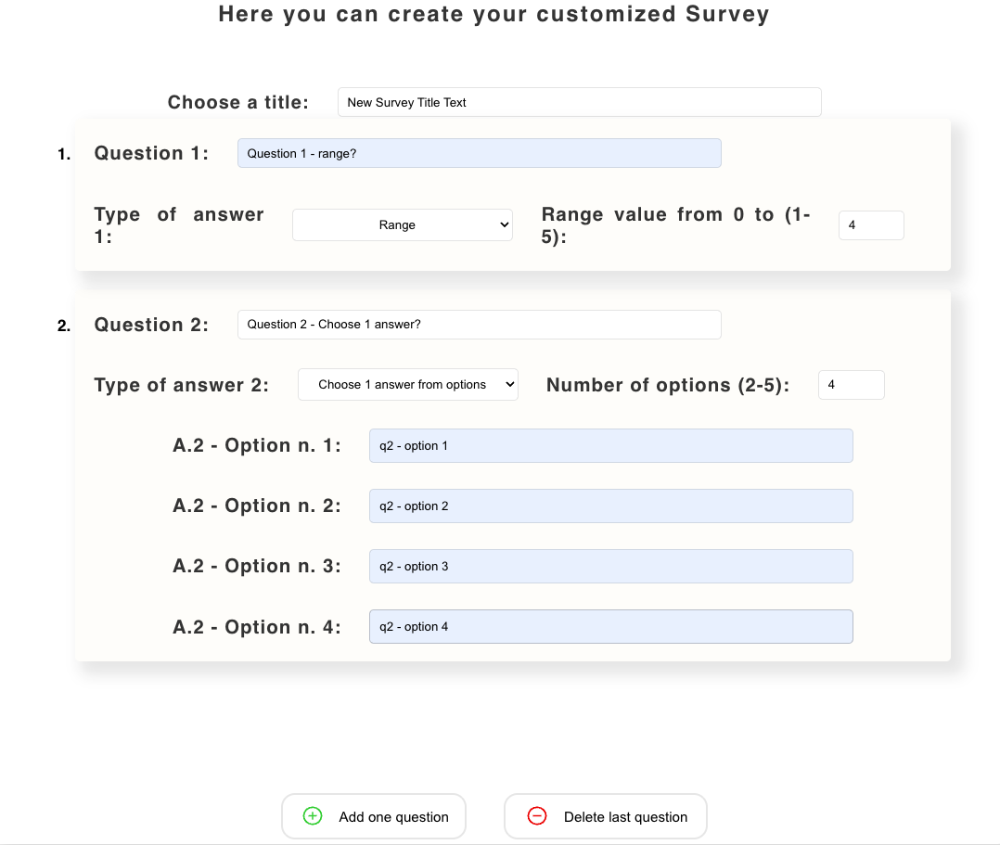

<div align="center" style="background:black;">
  
</div>

# Survey App

Survey app created with React, divided into two sections: one exclusive for the **Creators** and another for the **Participants**. <br /><br />
Survey research to assess thoughts, opinions and feelings from the users.

## Technologies

This project was created with:

-   Front-End: HTML, CSS, JS ([Create React App](https://github.com/facebook/create-react-app))
-   Back-End: [Node.js](https://nodejs.org/en/about/) / [Express](http://expressjs.com)
-   Data: [PostgreSQL](https://www.postgresql.org)

## Setup

First of all clone the repo on your own machine

```bash
git clone https://github.com/lmguerrini/survey-app.git
```

Install all the dependencies required

```bash
npm install
```

Start the server

```bash
npm run dev
```

Now you should be ready to dive into the Survey App at http://localhost:3000

## Main features

-   #### `Creators:`
    -   Create new customized surveys
    -   Get results and insights from collected users data
-   #### `Participants:`
    -   Fill in a pre-selected survey via shared link
        <br />

## Preview

### Creators - Home


### Create New Survey


-   #### Type of Question: `Range`

 &emsp;


-   #### Type of Question: `Choose 1 answer`

 &emsp;


-   #### Type of Question: `Choose 1+ answers`

 &emsp;


-   #### Type of Question: `Text`

 &emsp;


### Shareable link for participants

 &emsp;


### Results & Insights


-   #### Results

    

-   #### Results: normal view

    

-   #### Results: expanded view w/ chart insights

    

### Participants - Start Survey


### Fill in pre-selected Survey

 &emsp;


### Survey submitted


---

[****](#survey-app)
